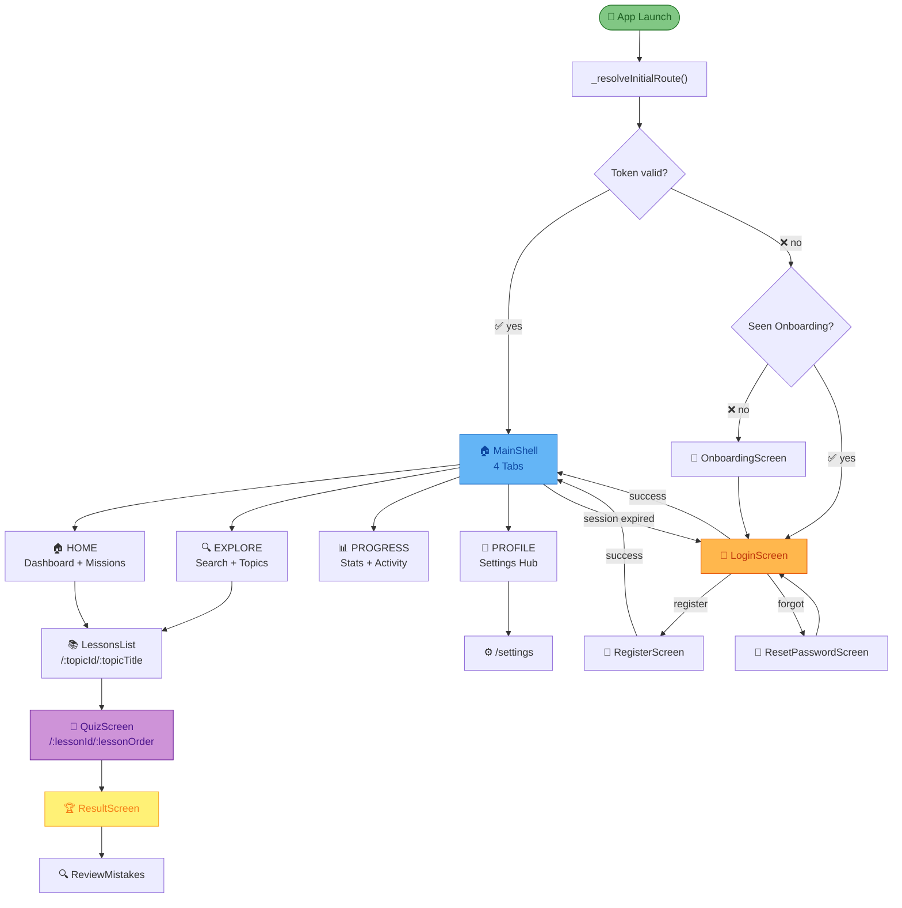
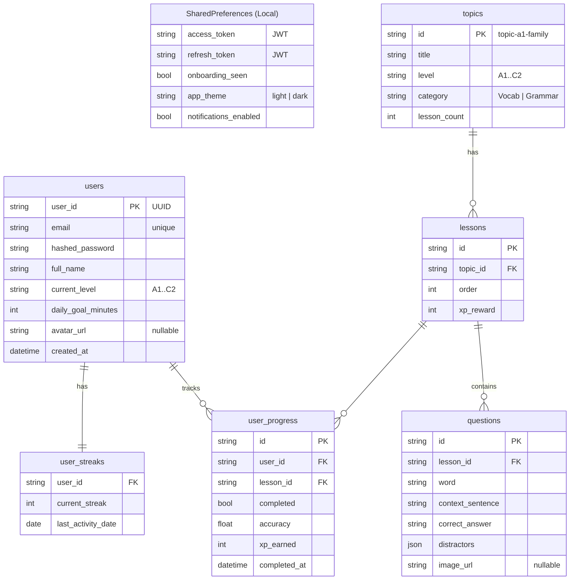
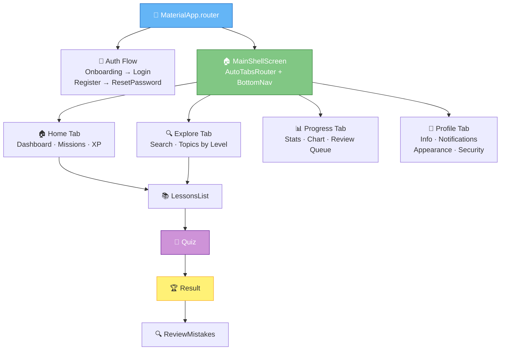
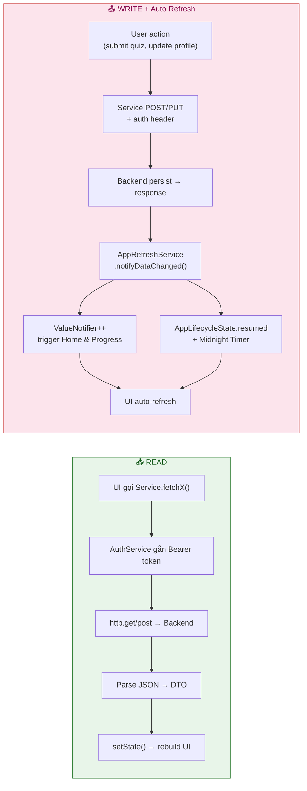
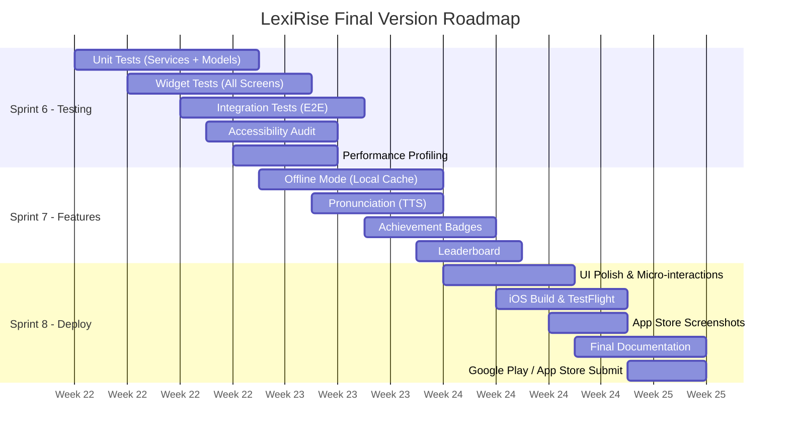

# 📘 LexiRise Mobile App — Week 5 Design & Architecture Report

> **Team:** LexiRise Development Team  
> **Project:** Ứng dụng học tiếng Anh theo chuẩn CEFR (A1 → C2)  
> **Semester:** 2025-2026  
> **Framework:** Flutter 3.9+ (Dart SDK ^3.9.0)  
> **Kiến trúc:** Clean Architecture + auto_route + Service-Oriented State

---

## 📋 Mục lục

1. [App Architecture Diagram](#1-app-architecture-diagram)
2. [Navigation Flow Diagram](#2-navigation-flow-diagram)
3. [API Communication Diagram](#3-api-communication-diagram)
4. [Database & Local Storage Schema](#4-database--local-storage-schema)
5. [UI/UX Component Tree](#5-uiux-component-tree)
6. [Data Flow Model](#6-data-flow-model)
7. [Quality Measures](#7-quality-measures)
8. [Deliverables Assessment](#8-deliverables-assessment)
9. [Final Roadmap](#9-final-roadmap)

---

## 1. App Architecture Diagram

LexiRise áp dụng **Clean Architecture tinh gọn** kết hợp **auto_route** cho navigation type-safe và **Service-Oriented State** với `ValueNotifier`. Các layer được phân tách rõ ràng theo nguyên tắc **Dependency Inversion**.

```mermaid
graph TB
    subgraph PRESENTATION["🎨 Presentation Layer"]
        AUTH["Auth Screens<br/>Onboarding · Login · Register<br/>ResetPassword"]
        HOME["HomeScreen · Dashboard"]
        EXPLORE["ExploreScreen · Browse"]
        QUIZ["QuizScreen · Result<br/>ReviewMistakes"]
        PROG["ProgressScreen · Stats"]
        PROF["ProfileScreen · Settings<br/>PersonalInfo · Notifications<br/>Appearance · Security"]
    end

    subgraph ROUTING["🧭 Routing Layer (auto_route)"]
        RTR["AppRouter<br/>type-safe code-gen"]
        ROUTES["AppRoutes<br/>centralized constants"]
        SHELL["MainShellScreen<br/>4-tab bottom nav"]
    end

    subgraph DOMAIN["🧠 Domain Models"]
        NAV["NavigationItem<br/>iconCodePoint + label"]
        DTO["Auth DTOs<br/>User · AuthResponse<br/>RegisterRequest"]
    end

    subgraph SERVICES["⚙️ Service Layer"]
        AS["AuthService<br/>login · register · refresh"]
        LS["LearningService<br/>topics · lessons · quiz"]
        US["UserService<br/>dashboard · profile · progress"]
        NS["NotificationService"]
        TS["ThemeService"]
        REF["AppRefreshService<br/>ValueNotifier broadcast"]
    end

    subgraph DATA["💾 Data Layer"]
        API["ApiService<br/>REST endpoints /api/v1"]
        HTTP["http.Client"]
        SP["SharedPreferences<br/>tokens · theme · onboarding"]
    end

    subgraph BACKEND["🖥️ Backend"]
        BE["FastAPI + MySQL<br/>JWT Auth"]
    end

    PRESENTATION --> ROUTING
    ROUTING --> SERVICES
    DOMAIN -.->|"used by"| PRESENTATION
    DOMAIN -.->|"used by"| SERVICES
    SERVICES --> DATA
    DATA --> BACKEND

    style PRESENTATION fill:#e8f5e9,stroke:#2e7d32,color:#1b5e20
    style ROUTING fill:#fff3e0,stroke:#e65100,color:#bf360c
    style DOMAIN fill:#e3f2fd,stroke:#0d47a1,color:#0d47a1
    style SERVICES fill:#fce4ec,stroke:#c62828,color:#880e4f
    style DATA fill:#f3e5f5,stroke:#6a1b9a,color:#4a148c
    style BACKEND fill:#e0f7fa,stroke:#006064,color:#004d40
```



| Layer | Trách nhiệm | File tiêu biểu |
|---|---|---|
| 🎨 **Presentation** | UI Widgets, bắt sự kiện người dùng, hiển thị dữ liệu | `home_screen.dart`, `quiz_screen.dart` |
| 🧭 **Routing** | Điều hướng type-safe, code-generated, centralized paths | `app_router.dart`, `app_routes.dart`, `main_shell.dart` |
| 🧠 **Domain** | Pure Dart models, không phụ thuộc Flutter framework | `navigation_item.dart`, `auth_model.dart` |
| ⚙️ **Service** | Business logic, gọi API, parse JSON → DTO, quản lý state | `auth_service.dart`, `learning_service.dart` |
| 💾 **Data** | HTTP calls, local key-value storage | `api_service.dart`, `SharedPreferences` |
| 🖥️ **Backend** | FastAPI + MySQL, JWT authentication | `/api/v1/*` endpoints |

### Tiến hóa kiến trúc (Week 1 → Week 5)

| Giai đoạn | Kiến trúc | Điểm mới |
|---|---|---|
| Week 1-2 | Monolithic Widgets | Mọi logic API nằm trong Widget |
| Week 3-4 | Service Layer | Tách `AuthService`, `LearningService`, `UserService` |
| Week 5 | **Clean Architecture + auto_route** | ✨ auto_route type-safe router, centralized `AppRoutes`, `MainShellScreen`, `NavigationItem` domain model, `@RoutePage`/`@PathParam` annotations |

---

## 2. Navigation Flow Diagram



### Điểm mới về Navigation (Week 5)

| Trước | Sau |
|---|---|
| `Navigator.pushNamed(context, '/login')` | `context.router.push(const LoginRoute())` — **type-safe** |
| Route paths rải rác trong code | **Centralized** `AppRoutes` constants |
| `FutureBuilder` chọn initial route | `_resolveInitialRoute()` async → `DeepLink` |
| `MainNavigationShell` widget cũ | `MainShellScreen` + `AutoTabsRouter` |
| Params truyền qua constructor | `@PathParam('lessonId')` auto-extract |

---

## 3. API Communication Diagram

```mermaid
sequenceDiagram
    actor U as 👤 User
    participant UI as Flutter UI
    participant SVC as Service Layer
    participant AUTH as AuthService
    participant HTTP as http.Client
    participant BE as FastAPI
    participant DB as MySQL

    rect rgb(232, 245, 233)
        Note over U,DB: 🔐 AUTHENTICATION
        U->>UI: email + password
        UI->>AUTH: login(email, password)
        AUTH->>HTTP: POST /api/v1/auth/login
        HTTP->>BE: Request
        BE->>DB: verify credentials
        DB-->>BE: user record
        BE-->>HTTP: 200 {tokens, user}
        HTTP-->>AUTH: Response
        AUTH->>AUTH: saveToken() → SharedPreferences
        AUTH-->>UI: AuthResponse
        UI->>U: → MainShell
    end

    rect rgb(227, 242, 253)
        Note over U,DB: 📡 AUTHENTICATED REQUEST + AUTO REFRESH
        U->>UI: open Dashboard / do Quiz
        UI->>SVC: fetchData()
        SVC->>AUTH: sendAuthenticatedRequest()
        AUTH->>AUTH: getAccessToken()
        AUTH->>HTTP: GET/POST /api/v1/*<br/>Bearer &lt;token&gt;
        HTTP->>BE: Authenticated Request

        alt Token Valid
            BE->>DB: query
            DB-->>BE: data
            BE-->>HTTP: 200 {data}
            HTTP-->>AUTH: Response
            AUTH-->>SVC: Response
            SVC->>SVC: parse JSON → DTO
            SVC-->>UI: DTO
            UI->>U: display
        else Token Expired (401)
            BE-->>HTTP: 401
            HTTP-->>AUTH: 401
            AUTH->>HTTP: POST /api/v1/auth/refresh
            HTTP->>BE: refresh
            BE->>DB: validate refresh token
            DB-->>BE: valid
            BE-->>HTTP: 200 {new_token}
            HTTP-->>AUTH: new token
            AUTH->>AUTH: saveToken()
            AUTH->>HTTP: retry original request
            HTTP->>BE: retry
            BE-->>HTTP: 200 {data}
            HTTP-->>AUTH: Response
            AUTH-->>SVC: Response
            SVC-->>UI: DTO
        else Refresh Fails
            AUTH->>AUTH: clearTokens()
            AUTH-->>UI: sessionExpiredStream
            UI->>U: → Login
        end
    end
```

| Cơ chế | Mô tả |
|---|---|
| **JWT Bearer** | Mọi request kèm `Authorization: Bearer <token>` |
| **Auto Refresh** | Phát hiện 401 → refresh token → retry (1 lần) |
| **Deduplicate** | Nhiều request 401 cùng lúc → gộp 1 lần refresh (`_refreshAccessTokenFuture`) |
| **Session Expiry** | Cả refresh cũng fail → broadcast `sessionExpiredStream` → redirect Login |

---

## 4. Database & Local Storage Schema



| Dữ liệu | Nơi lưu | Lý do |
|---|---|---|
| Auth tokens | `SharedPreferences` | Truy cập nhanh, key-value đơn giản |
| Theme preference | `SharedPreferences` | Boolean/enum, sync `ValueNotifier` |
| Onboarding flag | `SharedPreferences` | Boolean |
| Users, Topics, Progress | MySQL (Backend) | Persistence, quan hệ phức tạp, multi-device |

---

## 5. UI/UX Component Tree



| Component | Vị trí sử dụng | Mô tả |
|---|---|---|
| `MainShellScreen` | App root (sau login) | 4-tab bottom nav + session expiry listener |
| `CustomBottomNavigationBar` | `MainShellScreen` | Bottom nav bar tùy chỉnh |
| `RefreshIndicator` | Home, Explore, Progress | Pull-to-refresh |
| `FutureBuilder` | Tất cả data-fetching screens | Loading / Error / Data states |
| `PopScope` | Quiz, Result | Chặn back khi đang làm quiz |

---

## 6. Data Flow Model



| Trigger | Cơ chế | Mục đích |
|---|---|---|
| Quiz hoàn thành | `AppRefreshService.notifyLearningDataChanged()` | Cập nhật dashboard + progress ngay |
| App resumed | `WidgetsBindingObserver.didChangeAppLifecycleState` | Sang ngày mới → reload |
| Midnight timer | `Timer` đến đầu ngày hôm sau | Tự động tải dữ liệu ngày mới |
| Session expired | `AuthService.sessionExpiredStream` | Redirect về Login |

---

## 7. Quality Measures

### 7.1 Code Quality

| Tiêu chí | Áp dụng | Bằng chứng |
|---|---|---|
| **Clean Architecture** | Phân tách 6 layer rõ ràng | `screens/` → `routes/` → `services/` → `models/` |
| **SOLID - SRP** | Mỗi service 1 trách nhiệm | `AuthService` chỉ auth, `LearningService` chỉ learning |
| **SOLID - DIP** | Constructor injection | `LearningService({AuthService? authService})` |
| **DRY** | DTOs + validators dùng chung | `auth_model.dart`, `validators.dart` |
| **Type Safety** | `auto_route` code-gen + `fromJson`/`toJson` | Không còn string-based navigation |
| **Centralized Routes** | `AppRoutes` class | Tất cả path trong 1 file |
| **Framework Independence** | `NavigationItem` dùng `iconCodePoint` (int) | Domain model không phụ thuộc Flutter |
| **Linting** | `flutter_lints: ^6.0.0` | Static analysis toàn diện |
| **Error Handling** | try-catch + error state UI | `_handleError()` trong service, `_ErrorState` widget |
| **Null Safety** | Dart 3.9+ strict null safety | Toàn bộ codebase |

### 7.2 UI/UX Quality

| Tiêu chí | Áp dụng |
|---|---|
| **Material Design 3** | `useMaterial3: true` |
| **Light/Dark Theme** | `ValueListenableBuilder<ThemeMode>` |
| **Color System** | `ColorScheme.fromSeed(seedColor: Colors.deepPurple)` |
| **Loading States** | Skeleton screens (`_HomeSkeleton`, `_MissionSkeleton`) |
| **Error States** | Widget `_ErrorState` + nút Retry |
| **Empty States** | `_EmptyPanel(title, subtitle)` |
| **Back Guard** | `PopScope` + confirm dialog trong Quiz |
| **Animation** | `AnimationController` + scale/fade trong Result |

### 7.3 Performance

| Tiêu chí | Kỹ thuật |
|---|---|
| **Lazy Loading** | `FutureBuilder` + `ListView.builder` |
| **Caching** | `_cachedData` giữ data cũ khi refresh |
| **Deduplicate Requests** | `_refreshAccessTokenFuture` static |
| **Efficient Rebuilds** | `ValueListenableBuilder` rebuild cục bộ |
| **Memory** | `dispose()`: Timer, StreamSubscription, AnimationController, removeListener |
| **Shuffled Options** | Cache 1 lần trong `_shuffledOptions[question.id]` |

### 7.4 Testing

| Loại test | Trạng thái | Kế hoạch |
|---|---|---|
| Unit Tests (Services) | ⚠️ Chưa có | Mock HTTP, test `AuthService`, `LearningService` |
| Unit Tests (Validators) | ⚠️ Chưa có | Test `emailValidator`, `passwordValidator` |
| Unit Tests (Models) | ⚠️ Chưa có | Test `fromJson`/`toJson` round-trip |
| Widget Tests | ✅ Cơ bản | `widget_test.dart` |
| Integration Tests | ⚠️ Chưa có | Flow: Login → Dashboard → Quiz → Result |

---

## 8. Deliverables Assessment

| Tiêu chí | Mức độ | Ghi chú |
|---|---|---|
| **Kiến trúc rõ ràng, tiến hóa** | ✅ Đạt | Monolithic → Service → Clean Architecture + auto_route |
| **Phân tách layer rõ** | ✅ Đạt | 6 layer: Presentation, Routing, Domain, Service, Data, Backend |
| **Quality control mạnh** | ✅ Đạt | SOLID, DRY, linting, error handling, skeleton screens |
| **Prototype chạy được** | ✅ Đạt | Auth, Learning, Profile, Notifications, Theme |
| **Roadmap hoàn thiện** | ✅ Đạt | Sprint 6-8 rõ ràng |

| Tính năng | Trạng thái |
|---|---|
| Onboarding | ✅ |
| Register / Login (JWT) | ✅ |
| Reset Password | ✅ |
| Dashboard (XP, missions) | ✅ |
| Explore (search + filter) | ✅ |
| Lessons + Quiz + Result | ✅ |
| Review Mistakes | ✅ |
| Progress Tracking | ✅ |
| Profile Management | ✅ |
| Notifications (reminders) | ✅ |
| Light / Dark Theme | ✅ |
| Auto Token Refresh | ✅ |
| Session Expiry Handling | ✅ |
| **Type-safe Routing (auto_route)** | ✅ **NEW** |

---

## 9. Final Roadmap



| Sprint | Mục tiêu | Deliverables |
|---|---|---|
| **Sprint 6** | Testing & Polish | Unit/Widget/Integration tests; accessibility audit; performance profiling |
| **Sprint 7** | Enhanced Features | Offline mode; TTS pronunciation; Achievement badges; Leaderboard |
| **Sprint 8** | Polish & Deploy | UI micro-interactions; iOS TestFlight; Screenshots; Submit stores |

---

## 📁 Phụ lục: Cấu trúc thư mục

```
lib/
├── main.dart                              # Entry point + _resolveInitialRoute()
├── models/
│   ├── auth_model.dart                    # User, AuthResponse, RegisterRequest
│   └── navigation_item.dart               # Pure domain model (iconCodePoint)
├── routes/
│   ├── app_router.dart                    # @AutoRouterConfig + Route definitions
│   ├── app_router.gr.dart                 # Code-generated router
│   ├── app_routes.dart                    # Centralized path constants
│   └── main_shell.dart                    # @RoutePage 4-tab shell
├── utils/
│   └── validators.dart                    # Email, password, fullName validators
├── services/
│   ├── api_service.dart                   # REST endpoint constants
│   ├── auth_service.dart                  # Auth: login, register, refresh, me
│   ├── learning_service.dart              # Learning: topics, lessons, quiz (+ DTOs)
│   ├── user_service.dart                  # User: dashboard, profile, settings (+ DTOs)
│   ├── app_refresh_service.dart           # ValueNotifier broadcast
│   ├── theme_service.dart                 # Light/Dark theme (Singleton)
│   └── notification_service.dart          # Local notifications (Singleton)
├── widgets/
│   └── custom_bottom_navigation_bar.dart  # Reusable bottom nav bar
└── screens/
    ├── auth/
    │   ├── onboarding_screen.dart         # @RoutePage
    │   ├── login_screen.dart              # @RoutePage
    │   ├── register_screen.dart           # @RoutePage
    │   └── reset_password_screen.dart     # @RoutePage
    ├── home/
    │   └── home_screen.dart               # @RoutePage — Dashboard
    ├── explore/
    │   └── explore_screen.dart            # @RoutePage — Browse topics
    ├── lessons/
    │   ├── lessons_list_screen.dart       # @RoutePage — /:topicId/:topicTitle
    │   ├── quiz_screen.dart               # @RoutePage — /:lessonId/:lessonOrder
    │   ├── result_screen.dart             # Quiz results with animation
    │   └── review_mistakes_screen.dart    # Review incorrect answers
    ├── progress/
    │   └── progress_screen.dart           # @RoutePage — Stats + charts
    └── profile/
        ├── profile_screen.dart            # @RoutePage — Settings hub
        ├── personal_info_screen.dart      # Edit name, avatar, level
        ├── notifications_screen.dart      # Study reminders
        ├── appearance_screen.dart         # Theme selection
        └── security_screen.dart           # Change password
```

---

> **📝 Ghi chú:** Tất cả Mermaid diagram có thể dán vào [Mermaid Live Editor](https://mermaid.live) để render và xuất SVG/PNG.
